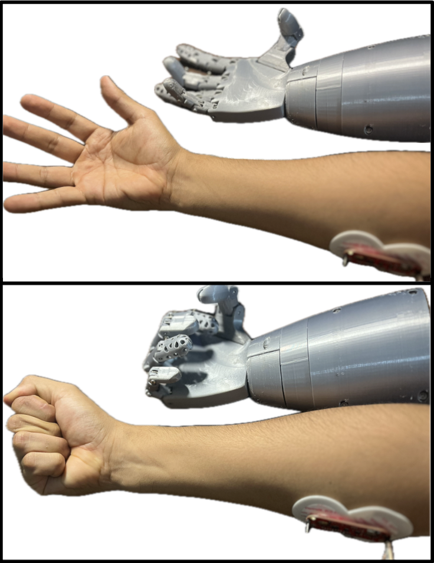

# 🦾 Bionic Hand Prosthesis for Children

Diseño y desarrollo de una prótesis de mano biónica asequible, dirigida a niños amputados. Utiliza control mioeléctrico mediante sensores EMG, servomotores y fabricación con impresión 3D.



---

## 🧠 ¿Por qué este proyecto?

La mayoría de prótesis biónicas son costosas, están pensadas para adultos y no consideran el crecimiento ni las necesidades emocionales de los niños. Este prototipo busca brindar **autonomía, funcionalidad y aceptación social** a un menor con amputación de mano.

---

## ⚙️ Características del sistema

- Controlado con señales EMG (Myoware + Arduino Nano)
- 3 grados de libertad (dedos, pulgar y rotación de muñeca)
- Movimiento proporcional mediante PWM
- Batería recargable (Li-Ion, 7.4V)
- Impreso en 3D con PLA y resina
- Costo aproximado: **$164 USD**
- Peso: **510 g**
- Duración batería: **3–6 horas**

---

## 🔩 Arquitectura del sistema

```plaintext
[ Músculo ] → [ Sensor EMG ] → [ Arduino Nano ] → [ Servomotores ] → [ Movimiento ]
```
- 3 servos MG996R: dedos, pulgar, muñeca
- Tendones artificiales (nylon)
- Sistema sincronizado de flexión
- Diseño CAD realizado en Autodesk Inventor

## 🧱 Archivos incluidos

- `/hardware/STL/` → piezas imprimibles
- `/firmware/` → código Arduino en C/C++
- `/images/` → diagramas, renders, resultados
- `/docs/` → documentación y poster académico

## 🧮 Resultados

| Métrica                | Valor                  |
| ---------------------- | ---------------------- |
| Fuerza por dedo        | 300g                   |
| Peso total             | 510g                   |
| Tiempo rotación muñeca | 0.51s                  |
| Tiempo flexión dedos   | 0.46s                  |
| Costo prototipo        | $164 USD               |
| Fuente de energía      | 2x Li-Ion 3.7V 1800mAh |

## 🧪 Limitaciones y mejoras futuras
- PLA es frágil ante impactos → usar ABS o Nylon

- Control EMG básico → se puede mejorar con control proporcional o redes neuronales

- No incluye socket para amputado → necesita integración con especialista médico

## 👨‍🔬 Autores
- David Alejandro Romero Yánez - daroyane@espol.edu.ec
- Milton Josué Sánchez Véliz - miljosan@espol.edu.ec
- Djalmar Jonathan Vargas Ortiz - djavorti@espol.edu.ec

Proyecto desarrollado en FIMCP – ESPOL, 2024.


## 📜 Licencia
Este proyecto está licenciado bajo la MIT License.


## 📎 Referencias
-📄[Poster del proyecto (PDF)](docs/PosterProyecto.pdf)

-📄[Resumen documento (PDF)](docs/ResumenProyecto.pdf)

